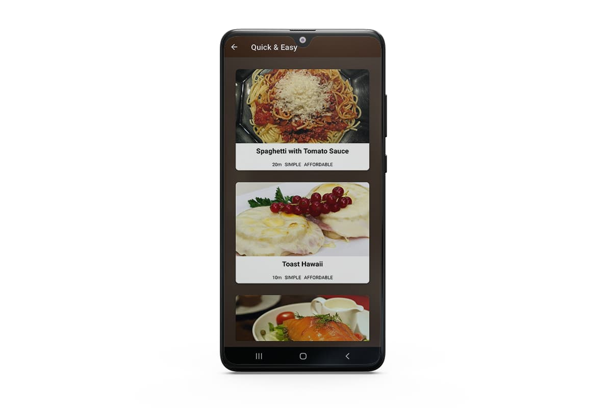
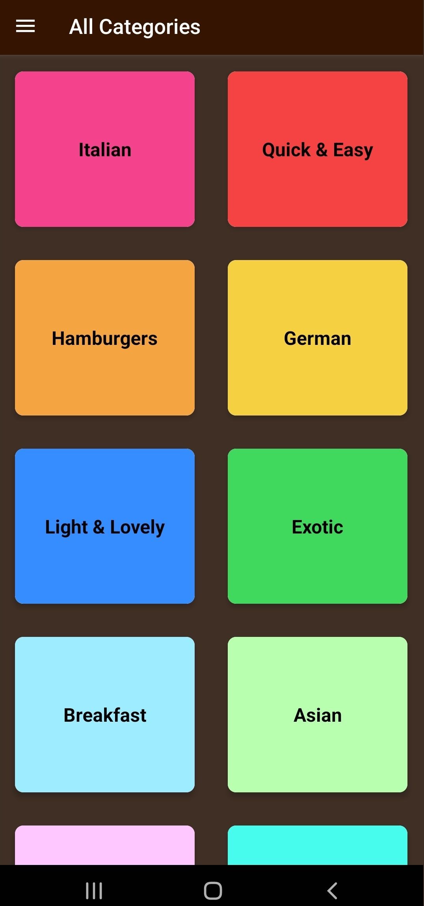
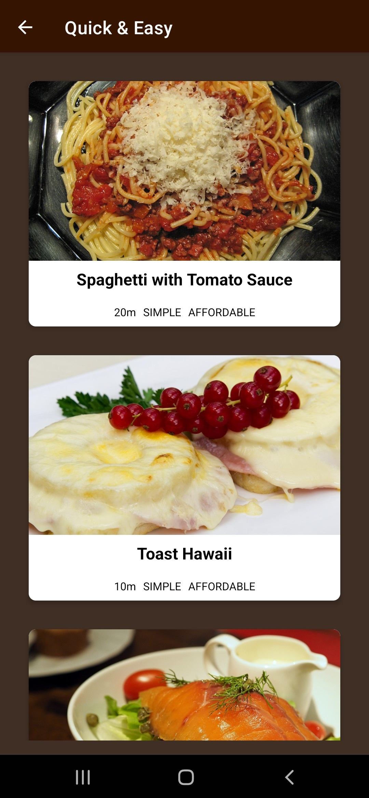
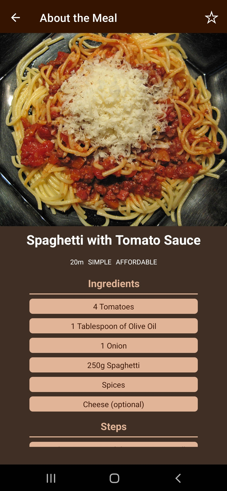
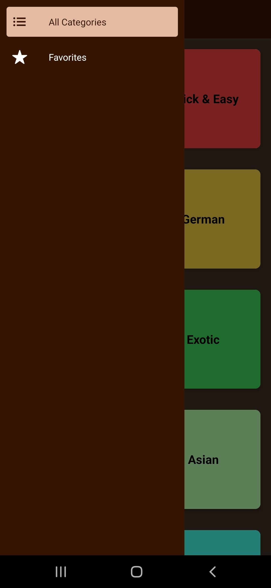
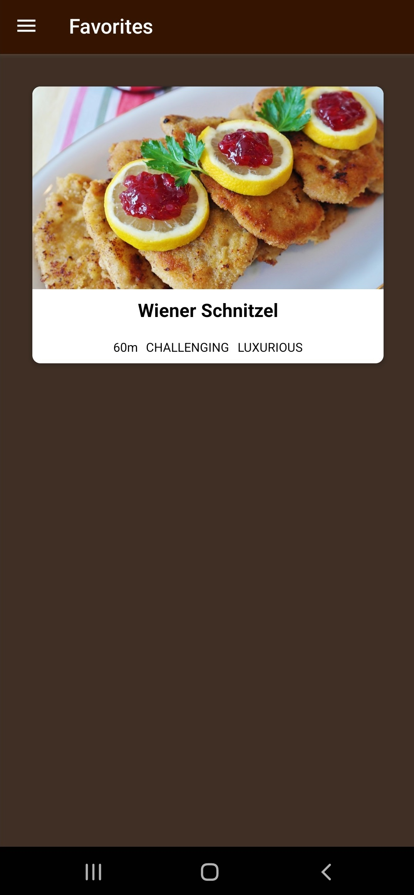

# Meals Application — React Native

> Meals Application with static data served via JSON file to simulate a backend.

<p align="center" >
 
</p>

# Table of Contents

- [Meals Application — React Native](#meals-application--react-native)
- [Table of Contents](#table-of-contents)
- [Instructions](#instructions)
- [Packages](#packages)
- [Application Images](#application-images)
  - [All Meal Categories](#all-meal-categories)
- [Quick and Easy Meals](#quick-and-easy-meals)
  - [Meal](#meal)
  - [Navigation](#navigation)
  - [Favourites](#favourites)

# Instructions

- Clone repo
- Install dependencies by running `npm install`
- Run `expo start` to run the application using [Expo](https://expo.dev/)
- Download the [Expo Go](https://expo.dev/) App for iOS/Android on the App Store/Google Play
- Scan the QR code on the terminal to launch the App in Development Mode on your phone

# Packages

```
├── @babel/core@7.18.6
├── @react-navigation/drawer@6.4.2
├── @react-navigation/native-stack@6.6.2
├── @react-navigation/native@6.0.10
├── @reduxjs/toolkit@1.8.3
├── expo-status-bar@1.2.0
├── expo@44.0.6
├── react-dom@17.0.1
├── react-native-gesture-handler@2.1.3
├── react-native-reanimated@1.13.4
├── react-native-safe-area-context@3.3.2
├── react-native-screens@3.10.2
├── react-native-web@0.17.1
├── react-native@0.64.3
├── react-redux@8.0.2
└── react@17.0.1
```

# Application Images

## All Meal Categories

<p align="center" >
 
</p>

# Quick and Easy Meals

<p align="center" >
 
</p>

## Meal

<p align="center" >
 
</p>

## Navigation

<p align="center" >
 
</p>

## Favourites

<p align="center" >
 
</p>
